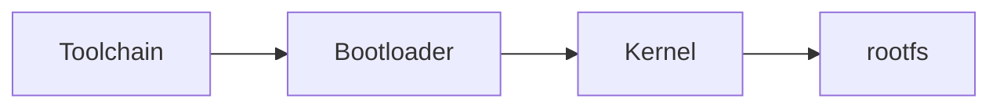

#Linux
# MIP - Minipočítače a jejich praktické aplikace

## Literatura
> [!example] Literatura
>- Linux Foundation - LFD450 Emedded Linux 
>- Chris Simmonds - Embedded Linux Design

## Cvičení
- [[TUL-navazující_studium/2. semestr/MIP-Minipocitace_a_jejich_prakticke_aplikace/cviceni/cv01|cv01]]
- [[TUL-navazující_studium/2. semestr/MIP-Minipocitace_a_jejich_prakticke_aplikace/cviceni/cv02|cv02]]

## Sestavujeme Embedded

> [!quote] TBKR - To bude krutý
\- Třísková

> [!example] Co budeme potřebovat:
>1. Toolchain
>2. [[u-Boot|Bootloader]]
>3. [[Kernel - kompilace|Kernel]]
>4. rootfs

### Bootloader
Správa disku (flash)
Nahrazuje BIOS na embedded.
Má tři úrovně: 1,2,3
1. najde zavaděč jádra
2. zavaděč jádra (ne Grub, ale u-Boot)

[[u-Boot|u-Boot]]
Umožňuje over the air update.

device tree

### Kernel
[[Kernel - kompilace|Kompilace linuxového]] jádra.

### rootfs
Disk přečtený bajt po bajtu.
`rootfs-fat4.img`
Filesystém v taru. 
- Do jakého formátu disku se má nahrát
- kolik bude mít diskových oddílů

### Toolchain - Řetězec nástrojů
binutils
- překladač
	- cross compile (cílový platforma má jinou architekturu)
- linker
- assembler

systémová knihovna
- glibc (POSIX API, je dost velká, [[Lincence#GPL-2.0|GPL-2]])
- uclibc (horší POSIX kompatibilita)
- musl-libc 

## Nástroje pro sestavování
- Kconfig/Makefile
- ninja-CMate

- buildroot
- OpenEmbeded
	- bitbake 
		- paralelní sestavování dle závislosti receptů
		- recepty - python shell
- YocTo
	- využívá Layers (receptů bitbake)
	- PoKy